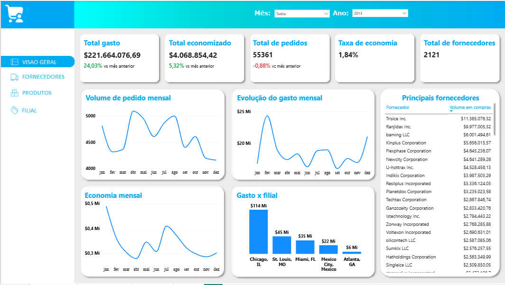
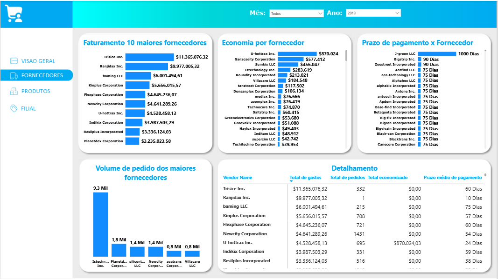
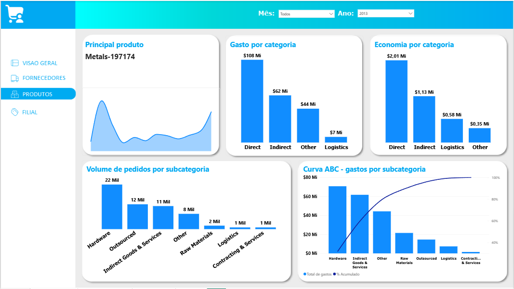
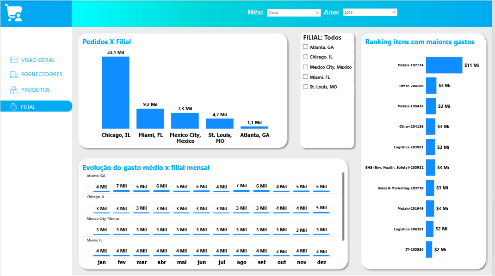

# Dashboard de Compras e Suprimentos

Projeto de Business Intelligence desenvolvido com foco na análise estratégica e operacional da área de compras e suprimentos de uma empresa de manufatura.

O objetivo do projeto é transformar dados transacionais de compras em informações relevantes para apoiar a tomada de decisão, permitindo identificar padrões de consumo, concentração de gastos, oportunidades de economia e performance de fornecedores.

---

# Objetivo do Projeto

Desenvolver um dashboard interativo no Power BI capaz de responder perguntas estratégicas e operacionais relacionadas às compras corporativas.

O projeto busca fornecer:

* Visão executiva dos principais indicadores de compras
* Monitoramento da evolução dos gastos ao longo do tempo
* Análise de fornecedores e categorias de produtos
* Identificação de oportunidades de redução de custos
* Apoio à tomada de decisão baseada em dados

---

# Problema de Negócio

A diretoria da empresa não possuía visibilidade clara sobre:

* Como os gastos estavam distribuídos
* Quais fornecedores concentravam maior volume financeiro
* Quais categorias geravam maior impacto financeiro
* Como os custos evoluíam ao longo do tempo
* Onde existiam oportunidades de economia e otimização

O dashboard foi desenvolvido para centralizar essas informações e facilitar análises rápidas e estratégicas.

---

# Dataset

A base de dados representa operações de compras de uma empresa de manufatura.

## Tabelas Utilizadas

| Tabela            | Descrição                        |
| ----------------- | -------------------------------- |
| Currency          | Moedas utilizadas nas transações |
| Exchange Rate     | Taxa de câmbio                   |
| Invoice           | Pedidos de compra                |
| Invoice Line Item | Itens de cada pedido             |
| Item              | Informações dos produtos         |
| Vendor            | Informações dos fornecedores     |
| Location          | Filiais da empresa               |
| Date              | Calendário                       |

---

# Estrutura da Modelagem

A modelagem foi construída em torno da tabela de pedidos de compra (`Invoice`), onde:

* Cada pedido pode conter um ou mais itens
* Os itens são detalhados na tabela `Invoice Line Item`
* Os descontos e economias são calculados a partir das relações entre pedidos e itens

Foi utilizada modelagem dimensional com foco em performance analítica e escalabilidade.

---

# Etapas do Projeto

## 1. Entendimento do Negócio

* Levantamento das necessidades da diretoria
* Definição das principais perguntas de negócio
* Identificação dos indicadores estratégicos

## 2. Tratamento e Validação dos Dados

* Validação da integridade das tabelas
* Tratamento de inconsistências
* Ajuste de relacionamento entre tabelas
* Padronização temporal

## 3. Modelagem dos Dados

* Construção do modelo relacional
* Criação de dimensão calendário
* Definição das métricas DAX
* Estruturação das relações entre entidades

## 4. Desenvolvimento do Dashboard

O dashboard foi dividido em:

* Visão Executiva
* Visão por Fornecedor
* Visão por Produto
* Visão por Filial

## 5. Geração de Insights

* Análise descritiva dos indicadores
* Identificação de padrões de compra
* Levantamento de oportunidades estratégicas

---

# Indicadores Desenvolvidos

| Indicador              | Descrição                             |
| ---------------------- | ------------------------------------- |
| Total de Pedidos       | Quantidade total de pedidos distintos |
| Total de Gastos        | Soma total dos gastos                 |
| Total Economizado      | Soma total dos descontos/economia     |
| Taxa de Economia       | Relação entre economia e gasto total  |
| Total de Fornecedores  | Quantidade distinta de fornecedores   |
| Gasto Médio por Pedido | Média de gasto por pedido             |

---

# Perguntas de Negócio Respondidas

## Visão Executiva

* Qual é o gasto total da operação?
* Qual o total economizado?
* Os gastos estão aumentando ou diminuindo?
* Estamos realizando mais pedidos ao longo do tempo?
* Quais fornecedores possuem maior participação financeira?
* Qual filial possui maior concentração de gastos?

## Visão por Fornecedor

* Quais fornecedores possuem maior faturamento?
* Quais oferecem melhores condições de desconto?
* Existe concentração de compras em poucos fornecedores?
* Quais fornecedores oferecem maior prazo de pagamento?

## Visão por Produtos

* Quais produtos possuem maior incidência de compra?
* Quais categorias concentram maior parte dos gastos?
* Quais subcategorias representam 80% dos custos?
* Qual a economia gerada por categoria?

## Visão por Filial

* Qual o volume de compras por filial?
* Qual o gasto médio mensal por unidade?
* Quais produtos possuem maior impacto financeiro por região?

---

# Insights Obtidos

## 1. Concentração de Compras em um Único Fornecedor

O fornecedor `Trisice Inc.` concentra o maior volume financeiro de compras, totalizando aproximadamente 11,3 milhões em faturamento.

Apesar do alto volume negociado, o fornecedor não oferece condições de desconto relevantes, indicando uma oportunidade estratégica de:

* Renegociação contratual
* Revisão de política comercial
* Busca por fornecedores alternativos

Esse insight demonstra potencial de redução de custos através de negociação baseada em volume.

---

## 2. Alta Concentração de Gastos em Hardware e Serviços Indiretos

Cerca de 60% dos gastos da operação estão concentrados em:

* Hardware
* Bens e serviços indiretos

Dentro da categoria de hardware, o item `Electrical - 199499` apresentou alta recorrência de compra, com gasto médio próximo de 3 mil por pedido.

A análise levanta hipóteses importantes:

* Possível recompra excessiva
* Ineficiência operacional
* Necessidade de revisão de consumo
* Oportunidade de negociação de preço

---

## 3. Concentração Regional de Gastos

A filial de `Chicago, IL` apresentou o maior volume financeiro da operação.

Esse comportamento pode indicar:

* Centralização operacional
* Maior demanda regional
* Maior concentração de compras estratégicas

A análise sugere acompanhamento contínuo para verificar:

* Crescimento proporcional dos custos
* Eficiência operacional da unidade
* Evolução do ticket médio regional

---

# Tratamento de Dados e Qualidade Analítica

Durante a etapa de validação foi identificado um pedido sem correspondência de taxa cambial na tabela `Exchange Rate`.

Após investigação:

* O pedido estava associado a um fornecedor do México
* Não existia cotação registrada para a data da transação
* O impacto financeiro era irrelevante para o consolidado da base

O registro foi removido para evitar distorções nos indicadores financeiros.

---

# Construção da Dimensão Calendário

A tabela calendário original apresentava lacunas entre datas, impossibilitando sua utilização adequada em análises temporais.

Para solucionar o problema:

* Foi criada uma nova dimensão calendário contínua no Power Query
* A tabela cobre todas as datas entre o primeiro pedido registrado e a data atual
* A solução permitiu utilização correta de funções de inteligência temporal no Power BI

---

# Tecnologias Utilizadas

* Power BI
* Power Query
* DAX
* Modelagem Dimensional
* Excel

---

# Estrutura do Dashboard

## Página Executiva

Espaço destinado à visão estratégica da operação:

* KPIs principais
* Evolução temporal
* Ranking de fornecedores
* Distribuição regional dos gastos

## Página Operacional

Foco analítico e detalhado:

* Performance de fornecedores
* Análise de categorias
* Produtos mais comprados
* Indicadores por filial

---

# Imagens do Projeto

## Visão Executiva

## Visão por Fornecedor

## Visão por Produto

## Visão por Filial

---

# Principais Competências Demonstradas

* Business Intelligence
* Power BI
* Modelagem de Dados
* Power Query
* DAX
* Análise Exploratória de Dados
* Storytelling com Dados
* Geração de Insights Estratégicos
* Análise de Compras e Suprimentos

---

# Conclusão

O projeto foi desenvolvido com foco em transformar dados operacionais em informações estratégicas para suporte à tomada de decisão.

Além da construção visual do dashboard, o trabalho envolveu:

* Entendimento de negócio
* Modelagem de dados
* Tratamento de inconsistências
* Criação de métricas
* Geração de insights acionáveis

O resultado final permite acompanhar o comportamento das compras corporativas de forma clara, estratégica e orientada a dados.
